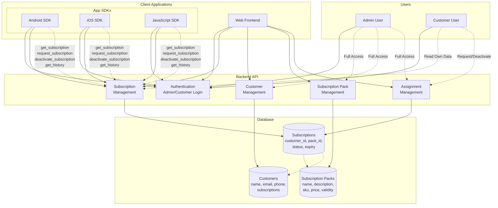
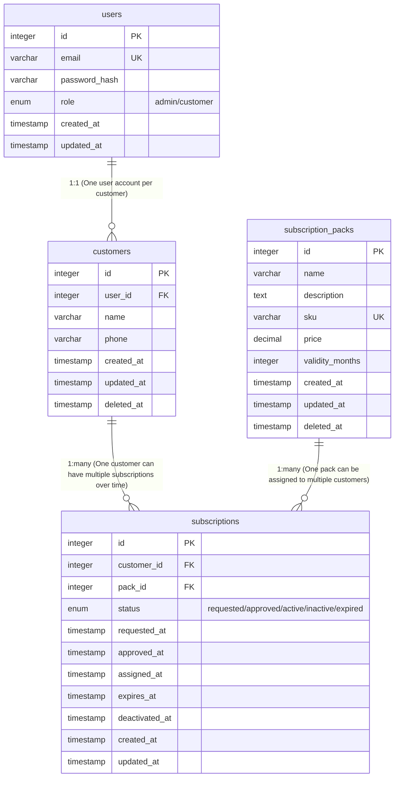
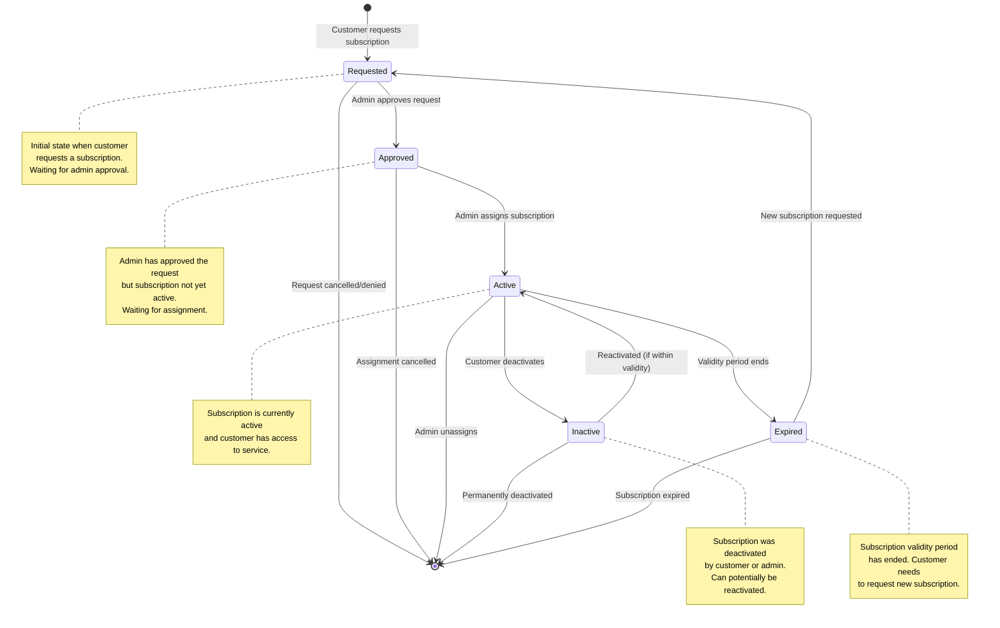

# License Management System

A comprehensive subscription and license management API built with Go/Gin framework. Supports both web frontend (JWT authentication) and mobile SDK (API key authentication) integrations.

## Table of Contents

1. [Core Components](#core-components)
2. [Architecture Diagram](#architecture-diagram)
3. [Database Entities](#database-entities)
4. [Entity Relationship Diagram](#entity-relationship-diagram)
5. [Subscription State Transitions](#subscription-state-transition-diagram)
6. [API Documentation](#api-documentation)
7. [Installation & Setup](#installation--setup)
8. [Quick Start](#quick-start)
9. [Complete API Endpoints Reference](#complete-api-endpoints-reference)
10. [Error Handling](#error-handling)
11. [Testing](#testing)
12. [Configuration](#configuration)
13. [Deployment](#deployment)
14. [Security Best Practices](#security-best-practices)
15. [Troubleshooting](#troubleshooting)
16. [Contributing](#contributing)
17. [License](#license)
18. [Support](#support)

---

## Core Components

### 1. User Management & Authentication

#### Admin Features
- **Login**: Admin authentication using email and password
- **System Administration**: Full access to manage customers, subscriptions, and assignments
- **Dashboard Access**: View system analytics, metrics, and recent activities

#### Customer Features
- **Registration**: Customer signup using email, password, name, and phone
- **Login**: Customer authentication using email and password
- **Profile Access**: View and manage own subscription details only
- **Self-Service**: Request new subscriptions and deactivate existing ones

### 2. Subscription Pack Management

#### Pack Attributes
- **Name**: Display name for the subscription plan
- **Description**: Detailed description of the plan features
- **SKU**: Unique identifier (hyphen-separated plan name)
- **Price**: Subscription cost (decimal format)
- **Validity Period**: Duration in months (1-12 months)

#### Operations
- **Create**: Add new subscription packs
- **List**: View all available subscription packs with pagination
- **Update**: Modify existing pack details
- **Soft Delete**: Deactivate packs without permanent removal

### 3. Customer Management

#### Customer Attributes
- **Name**: Full customer name
- **Email**: Unique email address (used for login)
- **Phone**: Contact phone number
- **Subscriptions**: List of customer's subscription history

#### Operations
- **Create**: Register new customers
- **List**: View customers with search and pagination
- **Update**: Modify customer information
- **Soft Delete**: Deactivate customer accounts

### 4. Subscription Lifecycle Management

#### Assignment Operations
- **Map Customer to Subscription**: Link customers with subscription packs
- **Direct Assignment**: Admin can assign subscriptions without customer request
- **Unassignment**: Remove subscription assignments before expiry

#### Business Rules
- **Single Active Subscription**: One customer can have only one active subscription at a time
- **Automatic Activation**: New subscriptions activate only after current ones expire
- **Approval Workflow**: Customer requests require admin approval before activation

#### Status Management
- **Requested**: Initial state when customer requests subscription
  - Customer submits request → Status: `requested`
  - Waiting for admin approval
  - Customer cannot use subscription features
  
- **Approved**: Admin has approved the request
  - Admin approves subscription → Status: `approved`
  - Waiting for admin assignment
  - Customer cannot use subscription features yet
  - Customer cannot deactivate (not active yet)
  
- **Active**: Subscription is currently active and valid
  - Admin assigns subscription → Status: `active`
  - Customer has full access to subscription features
  - Only status that customers can deactivate
  - Only one active subscription per customer at a time
  
- **Inactive**: Subscription deactivated by customer or admin
  - Customer deactivates → Status: `inactive`
  - Admin can unassign → Subscription deleted
  - Customer cannot use subscription features
  
- **Expired**: Subscription validity period has ended
  - `expires_at` date passed → Status: `expired`
  - Customer needs to request new subscription

### 5. App SDK Integration

#### Supported Platforms
- **Android SDK**: Native Android application integration
- **iOS SDK**: Native iOS application integration
- **JavaScript SDK**: Web and cross-platform application integration

#### Authentication
- **Email/Password**: Basic authentication for SDK clients
- **API Key Generation**: System generates unique API keys for SDK authentication
- **Header-based Auth**: API keys passed in request headers

#### SDK Operations
- **Get Current Subscription**: Retrieve customer's active subscription with validity status
- **Request Subscription**: Submit subscription requests (requires admin approval)
- **Deactivate Subscription**: Cancel current active subscription
- **Subscription History**: Retrieve paginated history of past subscriptions
- **Sorting Support**: Sort subscription history by various parameters

#### Security & Access Control
- **Customer Data Isolation**: SDK clients can only access their own subscription data
- **API Key Validation**: Each request validated against customer's API key
- **Rate Limiting**: Prevent abuse with configurable rate limits

### 6. Backend Architecture

#### API Layers
- **Frontend APIs**: RESTful endpoints for web applications
  - JWT Bearer authentication for protected endpoints
  - Pagination and filtering support
  - Comprehensive CRUD operations
- **SDK APIs**: Simplified endpoints optimized for mobile/desktop apps
  - API key authentication
  - Customer-focused operations
  - Lightweight response structures

#### Core Responsibilities
- **Authentication & Authorization**: Multi-scheme auth (JWT + API Keys)
- **Business Logic**: Subscription lifecycle management and validation
- **Data Management**: Database operations with proper error handling
- **API Gateway**: Request routing, rate limiting, and security
- **Audit Trail**: Track all system changes and user actions

#### Technology Stack
- **Framework**: Go/Gin for RESTful API development
- **Database**: SQLite/PostgreSQL with proper indexing
- **Authentication**: JWT tokens with configurable expiration
- **Documentation**: OpenAPI 3.0 specification
- **Deployment**: Containerized with Docker support

## Architecture Diagram



## Database Entities

### Core Tables

#### 1. Users

**Purpose**: Authentication and authorization for both admin and customer users

```sql
CREATE TABLE users (
    id INTEGER PRIMARY KEY AUTOINCREMENT,
    email VARCHAR(255) UNIQUE NOT NULL,
    password_hash VARCHAR(255) NOT NULL,
    role ENUM('admin', 'customer') NOT NULL DEFAULT 'customer',
    created_at TIMESTAMP DEFAULT CURRENT_TIMESTAMP,
    updated_at TIMESTAMP DEFAULT CURRENT_TIMESTAMP ON UPDATE CURRENT_TIMESTAMP
);
```

#### 2. Customers

**Purpose**: Customer profile information and management

```sql
CREATE TABLE customers (
    id INTEGER PRIMARY KEY AUTOINCREMENT,
    user_id INTEGER NOT NULL,
    name VARCHAR(255) NOT NULL,
    phone VARCHAR(20),
    created_at TIMESTAMP DEFAULT CURRENT_TIMESTAMP,
    updated_at TIMESTAMP DEFAULT CURRENT_TIMESTAMP ON UPDATE CURRENT_TIMESTAMP,
    deleted_at TIMESTAMP NULL,
    FOREIGN KEY (user_id) REFERENCES users(id) ON DELETE CASCADE,
    UNIQUE(user_id)
);
```

#### 3. Subscription Packs

**Purpose**: Define available subscription plans/packages

```sql
CREATE TABLE subscription_packs (
    id INTEGER PRIMARY KEY AUTOINCREMENT,
    name VARCHAR(255) NOT NULL,
    description TEXT,
    sku VARCHAR(100) UNIQUE NOT NULL,
    price DECIMAL(10,2) NOT NULL,
    validity_months INTEGER NOT NULL CHECK (validity_months BETWEEN 1 AND 12),
    created_at TIMESTAMP DEFAULT CURRENT_TIMESTAMP,
    updated_at TIMESTAMP DEFAULT CURRENT_TIMESTAMP ON UPDATE CURRENT_TIMESTAMP,
    deleted_at TIMESTAMP NULL
);
```

#### 4. Subscriptions

**Purpose**: Track subscription assignments, requests, and lifecycle

```sql
CREATE TABLE subscriptions (
    id INTEGER PRIMARY KEY AUTOINCREMENT,
    customer_id INTEGER NOT NULL,
    pack_id INTEGER NOT NULL,
    status ENUM('requested', 'approved', 'active', 'inactive', 'expired') NOT NULL DEFAULT 'requested',
    requested_at TIMESTAMP DEFAULT CURRENT_TIMESTAMP,
    approved_at TIMESTAMP NULL,
    assigned_at TIMESTAMP NULL,
    expires_at TIMESTAMP NULL,
    deactivated_at TIMESTAMP NULL,
    created_at TIMESTAMP DEFAULT CURRENT_TIMESTAMP,
    updated_at TIMESTAMP DEFAULT CURRENT_TIMESTAMP ON UPDATE CURRENT_TIMESTAMP,
    FOREIGN KEY (customer_id) REFERENCES customers(id) ON DELETE CASCADE,
    FOREIGN KEY (pack_id) REFERENCES subscription_packs(id) ON DELETE CASCADE
);
```

## Entity Relationship Diagram



## Subscription State Transition Diagram



## API Documentation

The complete API specification is available in the [OpenAPI 3.0 format](openapi.yaml).

### Quick Start

The API is organized into two main sections:

#### Frontend APIs

- **Authentication** (`/api/`): Login and signup endpoints (no JWT required)
- **Dashboard & Management** (`/api/v1/`): Full-featured endpoints for web frontend (JWT required)

#### SDK APIs

- **Authentication** (`/sdk/auth`): SDK login endpoint (no auth required - generates API key)
- **Subscription Management** (`/sdk/v1/`): Simplified endpoints for mobile/desktop SDKs (API key required)

### Key Features

#### Authentication & Security

**Frontend APIs:**

- JWT Bearer authentication for protected endpoints (`Authorization: Bearer <jwt_token>`)
- Public authentication endpoints for login/signup (no auth required)
- Role-based access control (Admin vs Customer)
- Token expiration handling

**SDK APIs:**

- API Key authentication for protected endpoints (`X-API-Key: <api_key>`)
- SDK authentication endpoint generates API key (no auth required)
- Separate from frontend authentication for security isolation
- Optimized for embedded mobile/desktop applications

#### API Design Principles

- RESTful endpoints with consistent naming conventions
- Proper HTTP status codes and error responses
- Pagination support for list endpoints
- Input validation with clear error messages
- External identifiers (SKUs) instead of internal IDs where appropriate

#### Response Format

All API responses follow a consistent structure:

```json
{
  "success": true,
  "data": { ... },
  "pagination": { ... },
  "message": "..."
}
```

### Interactive Documentation

You can view the interactive API documentation by:

1. **Using OpenAPI Tools**: Import the `openapi.yaml` file into tools like:
   - [Swagger UI](https://swagger.io/tools/swagger-ui/)
   - [Postman](https://www.postman.com/)
   - [Insomnia](https://insomnia.rest/)

2. **Generating Client SDKs**: Use OpenAPI generators to create client libraries for:
   - JavaScript/TypeScript
   - Python
   - Java
   - Go
   - And many more languages

### Sample endpoints

To work with the API specification:

```bash

# Frontend authentication (no auth required)
curl -X POST http://localhost:8080/api/customer/login \
  -H "Content-Type: application/json" \
  -d '{"email":"user@example.com","password":"password"}'

# Frontend protected endpoint (JWT required)
curl -X GET http://localhost:8080/api/v1/customer/subscription \
  -H "Authorization: Bearer YOUR_JWT_TOKEN"

# SDK authentication (no auth required - generates API key)
curl -X POST http://localhost:8080/sdk/auth/login \
  -H "Content-Type: application/json" \
  -d '{"email":"user@example.com","password":"password"}'

# SDK protected endpoint (use API key from auth response)
curl -X GET http://localhost:8080/sdk/v1/subscription \
  -H "X-API-Key: sk-sdk-1234567890abcdef"
```

The API specification serves as the single source of truth for all API contracts and can be used for automated testing, documentation generation, and client SDK creation.

## Key Relationships & Constraints

### Business Rules Implemented

1. **User Authentication**:
   - Users table handles login for both admin and customers
   - Role-based access control (admin vs customer)

2. **Customer Management**:
   - One-to-one relationship between users and customers
   - Soft delete capability for customers

3. **Subscription Management**:
   - One customer can have multiple subscriptions over time
   - Only one active subscription per customer at any time (enforced by business logic)
   - Subscription lifecycle: `requested` → `approved` → `active` → `inactive`/`expired`

4. **Subscription Packs**:
   - Reusable plans that can be assigned to multiple customers
   - Soft delete for pack management
   - SKU uniqueness for plan identification

5. **Access Control**:
   - Customers can only access their own subscription data
   - Admins have full system access
   - SDK authentication via user credentials

### Indexes Recommended

```sql
-- Performance indexes
CREATE INDEX idx_users_email ON users(email);
CREATE INDEX idx_customers_user_id ON customers(user_id);
CREATE INDEX idx_subscriptions_customer_id ON subscriptions(customer_id);
CREATE INDEX idx_subscriptions_pack_id ON subscriptions(pack_id);
CREATE INDEX idx_subscriptions_status ON subscriptions(status);
CREATE INDEX idx_subscription_packs_sku ON subscription_packs(sku);
```

## Installation & Setup

### Prerequisites

- **Go 1.21+**: [Download Go](https://golang.org/dl/)
- **Git**: For cloning the repository
- **SQLite**: Included (or PostgreSQL for production)

### Installation Steps

1. **Clone the repository**:
```bash
git clone <repository-url>
cd License-MNM
```

2. **Navigate to backend directory**:
```bash
cd backend
```

3. **Install dependencies**:
```bash
go mod download
```

4. **Create admin user** (first time only):
```bash
go run cmd/seed/main.go
```

This creates:
- **Email**: `admin@example.com`
- **Password**: `admin123`

5. **Start the server**:
```bash
go run main.go
```

The server will start on `http://0.0.0.0:8080` (accessible from network)

## Quick Start

### 1. Start the Server

```bash
cd backend
go run main.go
```

The server will start on `http://0.0.0.0:8080` (accessible from network)

**For local testing:** Use `http://localhost:8080`  
**For mobile device testing:** Use `http://YOUR_IP_ADDRESS:8080` (e.g., `http://192.168.2.202:8080`)

### 2. Test Admin Login

```bash
curl -X POST http://localhost:8080/api/admin/login \
  -H "Content-Type: application/json" \
  -d '{"email":"admin@example.com","password":"admin123"}'
```

**Expected Response:**
```json
{
  "success": true,
  "token": "eyJhbGciOiJIUzI1NiIsInR5cCI6IkpXVCJ9...",
  "email": "admin@example.com",
  "expires_in": 3600
}
```

### 3. Test Customer Signup

```bash
curl -X POST http://localhost:8080/api/customer/signup \
  -H "Content-Type: application/json" \
  -d '{
    "name": "John Doe",
    "email": "customer@example.com",
    "password": "password123",
    "phone": "+1234567890"
  }'
```

**Expected Response:**
```json
{
  "success": true,
  "message": "Account created successfully",
  "token": "eyJhbGciOiJIUzI1NiIsInR5cCI6IkpXVCJ9...",
  "name": "John Doe",
  "phone": "+1234567890",
  "expires_in": 3600
}
```

### 4. Test SDK Login

```bash
curl -X POST http://localhost:8080/sdk/auth/login \
  -H "Content-Type: application/json" \
  -d '{"email":"customer@example.com","password":"password123"}'
```

**Expected Response:**
```json
{
  "success": true,
  "api_key": "sk-sdk-1f7ae96e807f3bfef29afc113756c496",
  "token": "eyJhbGciOiJIUzI1NiIsInR5cCI6IkpXVCJ9...",
  "name": "John Doe",
  "phone": "+1234567890",
  "expires_in": 3600
}
```

**Important:** Save the `api_key` for SDK endpoints (it never expires)

## Complete API Endpoints Reference

### Public Endpoints (No Authentication)

| Method | Endpoint | Description |
|--------|----------|-------------|
| POST | `/api/admin/login` | Admin login (returns JWT) |
| POST | `/api/customer/login` | Customer login (returns JWT) |
| POST | `/api/customer/signup` | Customer registration |
| POST | `/sdk/auth/login` | SDK login (returns API key) |

### Admin Endpoints (JWT Required)

| Method | Endpoint | Description |
|--------|----------|-------------|
| GET | `/api/v1/admin/dashboard` | Get dashboard statistics |
| GET | `/api/v1/admin/customers` | List all customers |
| POST | `/api/v1/admin/customers` | Create new customer |
| GET | `/api/v1/admin/customers/:id` | Get customer details |
| PUT | `/api/v1/admin/customers/:id` | Update customer |
| DELETE | `/api/v1/admin/customers/:id` | Delete customer |
| GET | `/api/v1/admin/subscription-packs` | List subscription packs |
| POST | `/api/v1/admin/subscription-packs` | Create subscription pack |
| PUT | `/api/v1/admin/subscription-packs/:id` | Update subscription pack |
| DELETE | `/api/v1/admin/subscription-packs/:id` | Delete subscription pack |
| GET | `/api/v1/admin/subscriptions` | List all subscriptions |
| POST | `/api/v1/admin/subscriptions/:id/approve` | Approve subscription |
| POST | `/api/v1/admin/customers/:id/assign-subscription` | Assign subscription to customer |
| DELETE | `/api/v1/admin/customers/:id/subscription/:id` | Unassign subscription |

### Customer Endpoints (JWT Required)

| Method | Endpoint | Description |
|--------|----------|-------------|
| GET | `/api/v1/customer/subscription` | Get current subscription |
| POST | `/api/v1/customer/subscription` | Request new subscription |
| DELETE | `/api/v1/customer/subscription` | Deactivate subscription |
| GET | `/api/v1/customer/subscription-history` | Get subscription history |

### SDK Endpoints (API Key Required)

| Method | Endpoint | Description |
|--------|----------|-------------|
| GET | `/sdk/v1/subscription` | Get current subscription |
| POST | `/sdk/v1/subscription` | Request new subscription |
| DELETE | `/sdk/v1/subscription` | Deactivate subscription |
| GET | `/sdk/v1/subscription-history` | Get subscription history |

## Error Handling

### HTTP Status Codes

| Status Code | Meaning | Description |
|-------------|---------|-------------|
| 200 | OK | Request successful |
| 201 | Created | Resource created successfully |
| 400 | Bad Request | Invalid request data or business rule violation |
| 401 | Unauthorized | Invalid or missing authentication |
| 403 | Forbidden | Insufficient permissions |
| 404 | Not Found | Resource not found |
| 500 | Internal Server Error | Server error |

### Error Response Format

All error responses follow this structure:

```json
{
  "success": false,
  "message": "Error description"
}
```

### Common Error Messages

#### Authentication Errors

- `"Authorization header required"` - Missing JWT token
- `"Invalid or expired token"` - JWT token expired or invalid
- `"Invalid credentials"` - Wrong email/password
- `"X-API-Key header required"` - Missing API key
- `"Invalid API key"` - API key not found or invalid

#### Business Logic Errors

- `"Customer already has an active subscription"` - Cannot assign/request when active subscription exists
- `"Subscription is not in requested status"` - Cannot approve non-requested subscription
- `"No active subscription found"` - Customer has no active subscription
- `"Subscription pack not found"` - Invalid pack SKU or ID
- `"Email already registered"` - Email already exists

#### Validation Errors

- `"Key: 'Email' Error:Field validation for 'Email' failed on the 'email' tag"` - Invalid email format
- `"Key: 'Password' Error:Field validation for 'Password' failed on the 'required' tag"` - Missing required field

## Testing

### Manual Testing with cURL

See `backend/CURL_COMMANDS.md` for complete curl command reference.

### Automated Testing

Run the test script:

```bash
cd backend
chmod +x quick_test.sh
./quick_test.sh
```

### Testing in Postman

1. Import `openapi.yaml` into Postman
2. Set up environment variables:
   - `base_url`: `http://localhost:8080`
   - `admin_token`: (from admin login)
   - `customer_token`: (from customer login)
   - `api_key`: (from SDK login)

## Configuration

### Environment Variables

Create a `.env` file in the backend directory:

```env
# Server Configuration
PORT=8080
HOST=0.0.0.0

# Database
DB_TYPE=sqlite
DB_PATH=license_mnm.db

# JWT Secret (Change in production!)
JWT_SECRET=your-secret-key-change-in-production

# CORS
CORS_ALLOW_ORIGINS=*
```

### Database Configuration

**SQLite (Default - Development)**:
- Database file: `license_mnm.db`
- No additional configuration needed

**PostgreSQL (Production)**:
- Update database connection in `database/database.go`
- Set environment variables for connection string

## Deployment

### Production Considerations

1. **Change JWT Secret**: Update `utils/jwt.go` with a strong secret
2. **Use PostgreSQL**: Switch from SQLite to PostgreSQL for production
3. **Enable HTTPS**: Use reverse proxy (nginx) with SSL certificates
4. **Set CORS**: Configure allowed origins in `main.go`
5. **Environment Variables**: Use environment variables for sensitive data
6. **Logging**: Implement proper logging (replace `gin.Default()` with custom logger)

### Deployment Options

#### Option 1: Docker

```dockerfile
FROM golang:1.21-alpine AS builder
WORKDIR /app
COPY . .
RUN go mod download
RUN go build -o license-mnm main.go

FROM alpine:latest
RUN apk --no-cache add ca-certificates
WORKDIR /root/
COPY --from=builder /app/license-mnm .
CMD ["./license-mnm"]
```

#### Option 2: Systemd Service

Create `/etc/systemd/system/license-mnm.service`:

```ini
[Unit]
Description=License MNM API Server
After=network.target

[Service]
Type=simple
User=www-data
WorkingDirectory=/opt/license-mnm/backend
ExecStart=/usr/local/go/bin/go run main.go
Restart=always

[Install]
WantedBy=multi-user.target
```

#### Option 3: PM2 (Node.js Process Manager)

```bash
npm install -g pm2
pm2 start "go run main.go" --name license-mnm
pm2 save
pm2 startup
```

## Security Best Practices

1. **JWT Secret**: Use a strong, randomly generated secret
2. **Password Hashing**: Passwords are hashed using bcrypt
3. **API Keys**: Store API keys securely (EncryptedSharedPreferences on mobile)
4. **HTTPS**: Always use HTTPS in production
5. **CORS**: Configure CORS to allow only trusted domains
6. **Rate Limiting**: Implement rate limiting for API endpoints
7. **Input Validation**: All inputs are validated before processing
8. **SQL Injection**: Using GORM prevents SQL injection

## Troubleshooting

### Server Won't Start

- Check if port 8080 is already in use
- Verify Go version: `go version` (requires 1.21+)
- Check database file permissions

### Authentication Fails

- Verify JWT token hasn't expired (24 hours)
- Check API key is correct for SDK endpoints
- Ensure Authorization header format: `Bearer TOKEN`

### Database Errors

- Check database file exists: `license_mnm.db`
- Verify database permissions
- Run seed script to create admin user

### Network Issues

- Ensure server is listening on `0.0.0.0:8080` (not just localhost)
- Check firewall settings
- Verify client and server are on same network

## Contributing

1. Fork the repository
2. Create a feature branch (`git checkout -b feature/amazing-feature`)
3. Commit your changes (`git commit -m 'Add amazing feature'`)
4. Push to the branch (`git push origin feature/amazing-feature`)
5. Open a Pull Request

## License

This project is licensed under the MIT License - see the LICENSE file for details.

## Support

For issues, questions, or contributions:
- Open an issue on GitHub
- Check the API documentation in `API_DOCUMENTATION.md`
- Review the OpenAPI specification in `openapi.yaml`

## Subscription Status Details

### Status Definitions

| Status | Meaning | Who Can Change | When It Happens |
|--------|---------|----------------|-----------------|
| `requested` | Customer requested subscription | Customer → Admin | Customer submits request |
| `approved` | Admin approved the request | Admin → Admin | Admin approves subscription |
| `active` | Subscription is active and valid | Admin → Customer/Admin | Admin assigns subscription |
| `inactive` | Subscription deactivated | Customer/Admin | Customer deactivates or admin unassigns |
| `expired` | Validity period ended | System | `expires_at` date passed |

### Status Transitions

**Normal Flow:**
```
requested → approved → active → inactive/expired
```

**Who Can Deactivate:**
- **Customers**: Can only deactivate `active` subscriptions
- **Admin**: Can unassign any subscription (any status)

**Business Rules:**
- Only one `active` subscription per customer at a time
- Cannot request new subscription while `active` exists
- `approved` subscriptions cannot be deactivated by customers (not active yet)
- `requested` subscriptions cannot be deactivated (waiting for approval)

## Base URL Configuration

### Development
- **Local**: `http://localhost:8080`
- **Network**: `http://YOUR_IP_ADDRESS:8080` (e.g., `http://192.168.2.202:8080`)
- **Android Emulator**: `http://10.0.2.2:8080`

### Production
- **HTTPS**: `https://your-domain.com`
- **Port**: Usually 443 (HTTPS) or 8080 (if behind reverse proxy)

## Network Configuration

### For Mobile Device Testing

1. **Find your computer's IP address:**
   ```bash
   # macOS/Linux
   ifconfig | grep "inet " | grep -v 127.0.0.1
   
   # Windows
   ipconfig
   ```

2. **Update server to listen on all interfaces:**
   - Server already configured: `r.Run("0.0.0.0:8080")`
   - Accessible from network devices

3. **Test connectivity:**
   ```bash
   # From your computer
   curl http://YOUR_IP:8080/api/admin/login
   
   # From mobile device (same Wi-Fi network)
   # Use: http://YOUR_IP:8080
   ```

## Common Workflows

### Customer Workflow

1. **Signup** → `POST /api/customer/signup`
2. **SDK Login** → `POST /sdk/auth/login` → Get API key
3. **Check Subscription** → `GET /sdk/v1/subscription`
4. **Request Subscription** → `POST /sdk/v1/subscription` (if no active)
5. **Wait for Admin** → Admin approves and assigns
6. **View Subscription** → `GET /sdk/v1/subscription` (now active)
7. **Deactivate** → `DELETE /sdk/v1/subscription` (if needed)

### Admin Workflow

1. **Login** → `POST /api/admin/login` → Get JWT token
2. **View Dashboard** → `GET /api/v1/admin/dashboard`
3. **Create Pack** → `POST /api/v1/admin/subscription-packs`
4. **List Subscriptions** → `GET /api/v1/admin/subscriptions?status=requested`
5. **Approve** → `POST /api/v1/admin/subscriptions/:id/approve`
6. **Assign** → `POST /api/v1/admin/customers/:id/assign-subscription`

## Additional Resources

- **API Documentation**: See `API_DOCUMENTATION.md` for Android/mobile integration
- **cURL Commands**: See `backend/CURL_COMMANDS.md` for all API examples
- **Step-by-Step Workflow**: See `backend/STEP_BY_STEP_WORKFLOW.md` for complete workflows
- **Run Instructions**: See `backend/RUN_INSTRUCTIONS.md` for detailed setup guide

---

**Last Updated:** December 2024  
**Version:** 1.0.0
